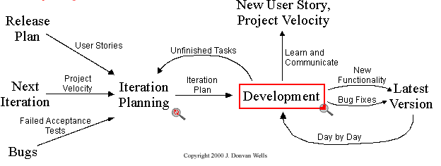

# eXtreme Programming

L'eXtreme Programming est une méthode agile conçue par **Kent BECK en 1996** _\(également **initiateur de JUnit** qui inspire jusqu'à aujourd'hui tous les frameworks d'unit-test\)_ dans le cadre du développement de C3 _\(Chrysler Comprehensive Compensation System\)_, l'outil de gestion de paie de Chrysler _\(avec actuellement plus de 77 000 salariés\)_.

Contrairement donc aux idées reçues, l'eXtreme Programming n'est pas une méthode adaptée uniquement pour les petites startups.

En plus des principes communs avec le Scrum, l'eXtreme Programming **aborde d'autres aspects complémentaires** concernant la **qualité de développement** _\(design, développement, pair programming, refactoring et testing\)_.

Le nom eXtreme Programming vient de l'idée de **pousser toutes les bonnes pratiques de développement habituelles à l'extreme**. Cf. [Principes de l'eXtreme Programming](principes-de-l-extreme-programming.md).

Malheureusement, le nom de la méthode en a effrayé plus d'un et Kent BECK reconnait que le nom est mal choisi.



