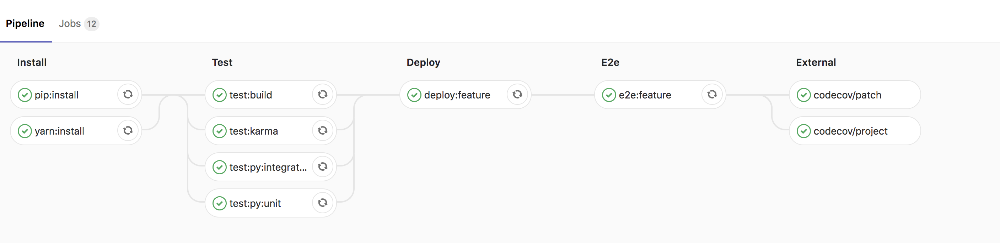
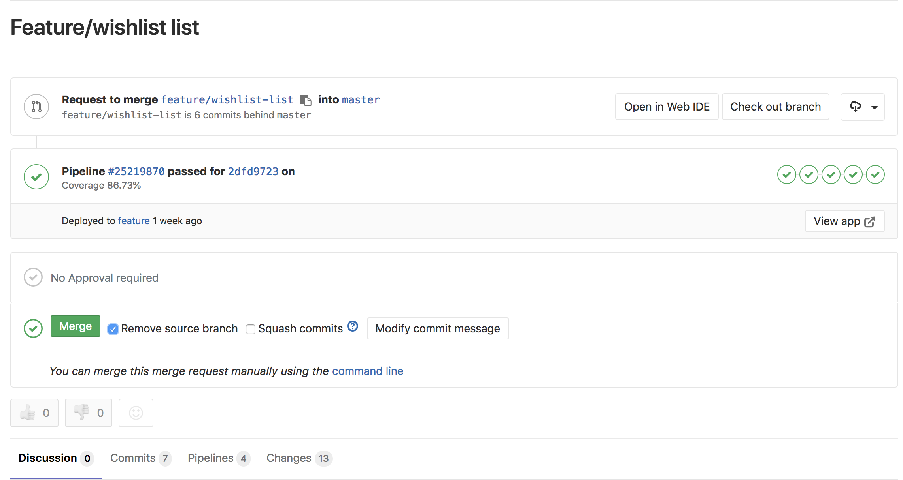
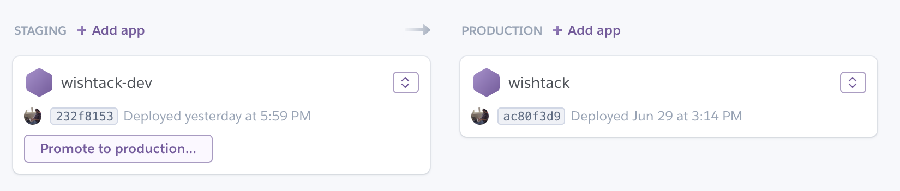
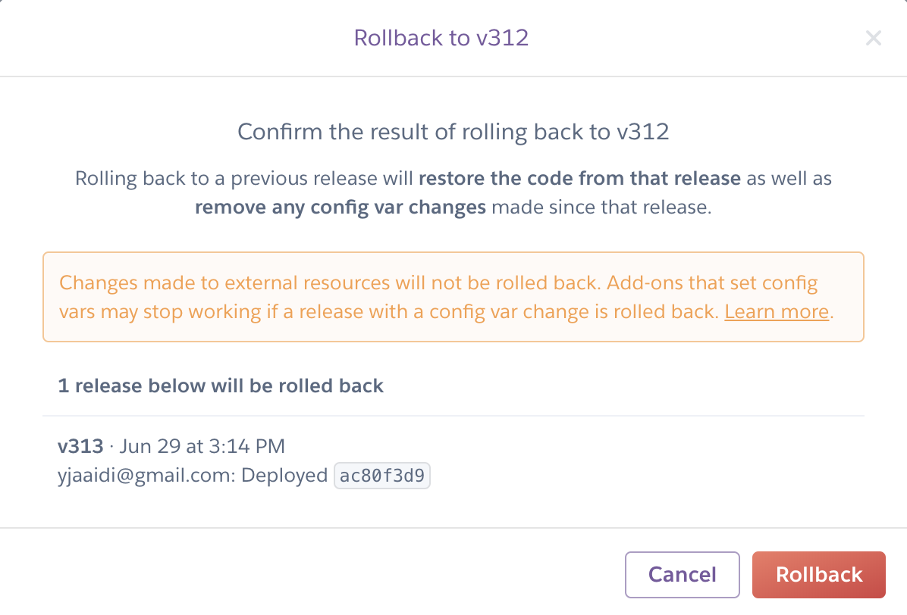

# Review Apps

Certains outils d'intégration continue combinés avec des plateformes de déploiement _\(Cf._ [_GitLab Review Apps_](review-apps.md#gitlab-review-apps) _&_ [_Heroku Review Apps_](review-apps.md#heroku-review-apps)_\)_ permettent de **créer dynamiquement des environnements de déploiement**.

Cela permet d'adopter l'approche de développement décrite ci-dessous.

Supposons que l'équipe de développement travaille sur deux fonctionnalités en parallèle **payin** _\(pour le crowdfunding\)_ et **cashout** _\(pour la récupération de la cagnotte\)_.

1. Le code de production est sur la branche `master`. 
2. L'équipe crée deux branches `payin` et `cashout` à partir de la branche `master`. 
3. A chaque changement _\(ou commit\)_ sur les branches `payin` ou `cashout` _\(et si tout se passe bien\)_, le produit **est déployé automatiquement sur un environnement créé dynamiquement et accessible depuis une URL** _\(ou plusieurs\)_ créée dynamiquement ; par exemple, **`payin.review.wishtack.com`** et **`cashout.review.wishtack.com`**. 
4. Les parties prenantes autorisées peuvent **valider 👍**_**\(ou rejeter 👎\)**_ le changement et **par simple clic**, le code est **"merged" dans la branche `master`**. 
5. La branche `master` passe automatiquement par les process de "**build**" et "**test**" de l'[Intégration Continue](integration-continue.md). Dans le cas du [Déploiement Continu](deploiement-continu.md) : le produit est **automatiquement déployé en production**. Dans le cas de la [Livraison Continue](livraison-continue.md) : le produit est **automatiquement déployé sur un environnement de validation** _\(staging\)_ et prêt à être déployé en production par **simple clic**.


De la même façon qu'il est idéal de définir les User Stories les plus granulaires possibles, il est recommandé de **réduire au minimum la durée de vie d'une branche et la quantité de changements**.

Il est intéressant de ne pas dépasser une **durée de vie d'un jour** pour chaque branche. Quitte à en recréer une nouvelle avec le même nom pour apporter de nouveaux changements.

Cela permet d'éviter le _**git spaghetti**_ et les **conflits de merge**.


## Exemple

### Pipeline de build, deploy et test de l'Intégration Continue

### Validation d'une branche _\(merge\)_

### Déploiement manuel _\(promote\)_

### Rollback

## Heroku Review Apps

{% embed data="{\"url\":\"https://devcenter.heroku.com/articles/github-integration-review-apps\",\"type\":\"link\",\"title\":\"Review Apps \| Heroku Dev Center\",\"description\":\"Run the code in any GitHub pull request in a complete, disposable Heroku app.\",\"icon\":{\"type\":\"icon\",\"url\":\"https://www.herokucdn.com/favicon.ico\",\"aspectRatio\":0},\"thumbnail\":{\"type\":\"thumbnail\",\"url\":\"https://www.herokucdn.com/images/og.png\",\"width\":1200,\"height\":630,\"aspectRatio\":0.525},\"caption\":\"Heroku Review Apps\"}" %}

## GitLab Review Apps



