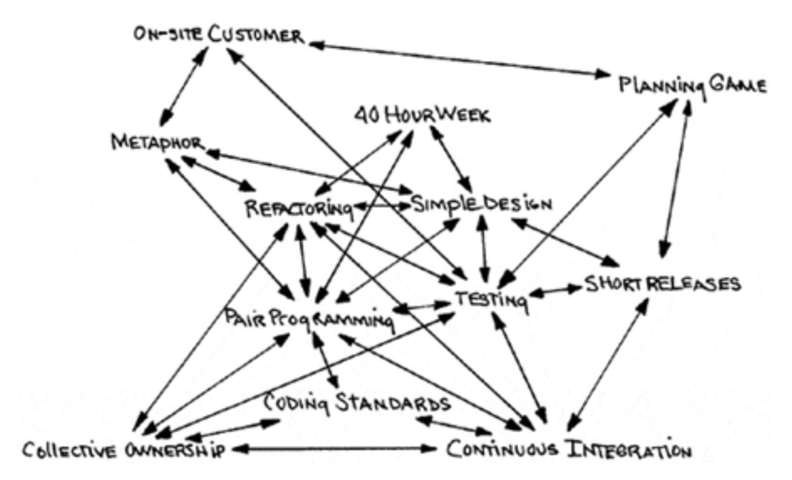
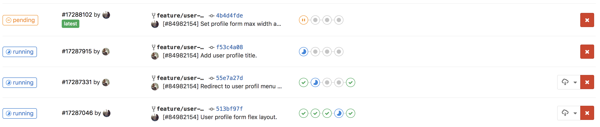
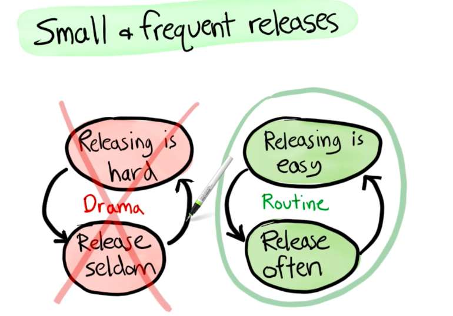
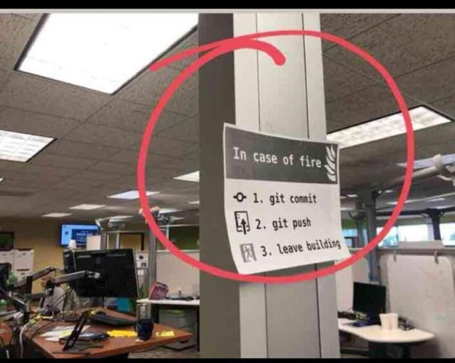
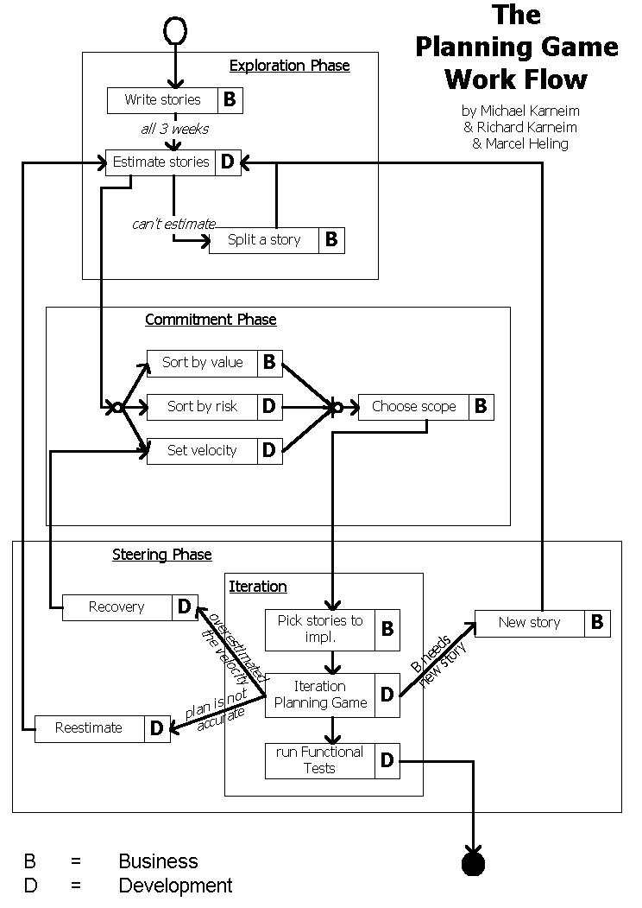

# Pratiques de l'eXtreme Programming

### Collective Ownership

N'importe quel développeur doit pouvoir modifier n'importe quelle partie du produit à n'importe quel moment.

**Le produit appartient à tous les membres** de l'équipe et **tout le monde est responsable** de l'ensemble.

### Pair Programming

Si le Code Review est une bonne pratique alors faisons du Code Review en permanence via du Pair Programming.

A minima, les parties les plus complexes du code doivent être développées en Pair Programming.

Le Pair Programming garantit une meilleure qualité de développement et encourage la propagation d'informations dans l'équipe.

### Testing

S'il est bien de tester le produit alors laissons tout le monde tester tout le temps via des tests unitaires automatisés, même les clients avec des tests fonctionnels.

### Refactoring

S'il est bien de concevoir avant de développer alors pourquoi en faire une tâche du quotidien pour tout le monde grâce au refactoring permanent.

Le Refactoring doit se faire dès que possible.


Le Refactoring n'est pas une tâche ou une User Story ; il fait partie de la réalisation de chaque tâche.


### Simplicité

Si les solutions les plus simples sont les plus séduisantes alors implémentons le système avec l'**architecture la plus simple** possible afin de répondre au **besoin actuel**.

L'équipe doit se concentrer sur le besoin actuel. Rien n'est implémenté à l'avance.  
Toutefois, le design du produit doit être extensible pour faciliter les enrichissements liés aux besoins futurs.


Soyons visionnaires mais pas devins.


### Métaphore

Si l'architecture est importante alors tout le monde participera à la définition et l'adaptation de l'architecture en permanence.

L'équipe définit des métaphores simples et compréhensibles par tous.

C'est le principe précurseur du Domain Driven Design.

### Intégration Continue

Si le testing de l'environnement d'intégration _\(ou staging ou qualification ou recette etc...\)_ est important alors nous intégrerons et testerons les changements plusieurs fois par jour.

Cela facilite entre autres, la traçabilité des effets de bord et erreurs etc... et évite les problèmes classique d'**Integration Hell**.


L'intégration continue n'est pas suffisante, il faut intégrer les changements le plus fréquemment possible.

Commencez progressivement par vous imposer d'intégrer les changements au moins une fois par journée puis une fois par demi-journée jusqu'à atteindre des dizaines de changements par jour et par développeur.

On peut aller jusqu'à des centaines de changements par jour. Cf. _Test && Commit \|\| Revert_ et le _Limbo_. [https://medium.com/@kentbeck\_7670/test-commit-revert-870bbd756864](https://medium.com/@kentbeck_7670/test-commit-revert-870bbd756864)


### Small Releases & Planning Game

Si les itérations courtes sont préférables alors utilisons des itérations très très courtes se mesurant en secondes, en minutes et en heures plutôt qu'en semaines, mois ou années.

Le Planning Game est quelque peu similaire au Sprint Planning mais il peut être invoqué à n'importe quel moment tel un Backlog Refinement.

[http://wiki.c2.com/?PlanningGame](http://wiki.c2.com/?PlanningGame)

Lors du Planning Game, les Business Owners \(Clients / Product Owner\) présentent les User Stories, l'équipe de développement évalue les User Stories puis les Business Owners sélectionnent le périmètre \(nombre de stories\) ou la Deadline.

