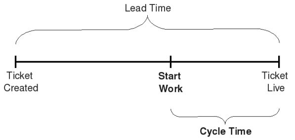

# Indicateurs et Paramètres

## Les quatres indicateurs du Workflow

* Vélocité,
* Lead Time,
* Cycle Time,
* Qualité,
* Prédictibilité : régularité de la vélocité et des livraisons.

Le Kanban est une **méthode empirique**.  
Les indicateurs ci-dessus se règlent indirectement avec les paramètres ci-dessous.

## Quelques paramètres

Nombre de personnes dans l'équipe.

Taille vs nombre d'équipes.

Work-In-Progress limit.

Durée des itérations.

Planification court terme / long terme.

