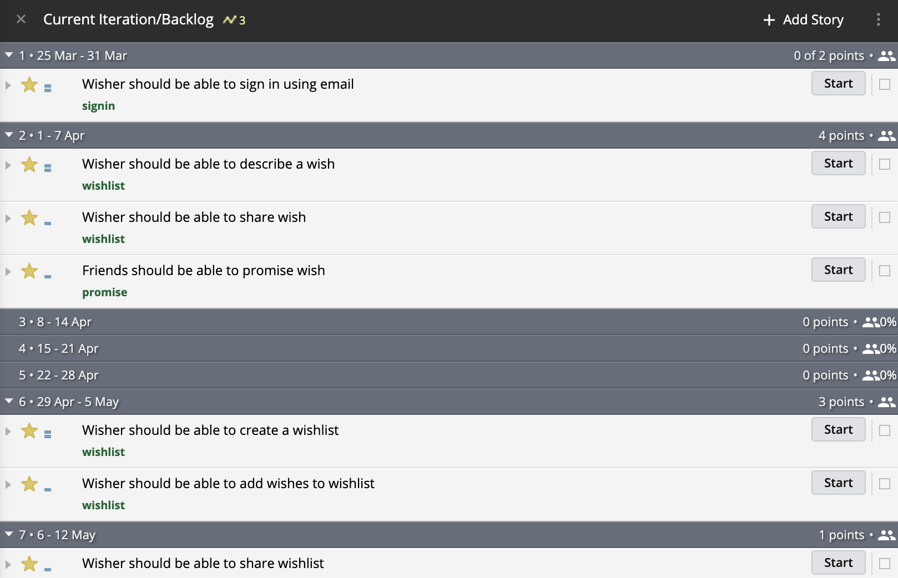
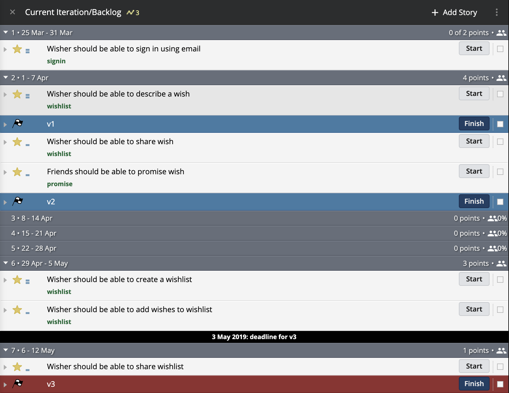

# Release Planning

## Objectifs du Release Planning

L'agilité n'empêche pas la planification à moyen ou long terme.

Le Release Planning est une **"macro" planification** _\(ou planification haut niveau\)_ permettant de **définir une ligne directrice** en **se projetant sur plusieurs semaines ou plusieurs mois**.

Le Release Planning permet :

* ⏱D'estimer les **dates de disponibilité** des nouvelles fonctionnalités _\(fixed scope\)_ ou inversement, les fonctionnalités disponibles à une certaine date _\(fixed deadline\)_.
* 🚨De **déceler les problèmes et retards** puis réagir le plus tôt possible.
* 🎯De **partager une vision d'ensemble**.
* 📦Synchroniser les équipes en cas d'interdépendance.

## Durée Couverte par le Release Planning


Plus la **durée couverte par le planning est longue**, plus la planification sera complexe et **moins elle sera précise**.

Une planification à plus de 6 mois est rarement rentable _\(rapport : énergie de planification vs précision\)_.



**Le Release Planning n'est pas nécessaire.**

La plupart du temps, une planification à 3 ou 4 itérations _\(avec des itérations d'une semaine\)_ suffit largement.

Cela est d'autant plus vrai dans le cadre d'une approche Lean Management.


## Release Planning vs Deployment


Contrairement à une idée communément reçue, le Release Planning **n'est pas lié au déploiement** des fonctionnalités implémentées.

Idéalement, l'équipe de développement devrait déployer ses changements en continu jusqu'à plusieurs fois par jour. Les fonctionnalités sont ensuite activées et déployées progressivement via des Feature Flags _\(Cf._ [_Déploiement Continu_](../extreme-programming/integration-continue-livraison-continue-et-deploiement-continu/deploiement-continu.md)_\)_.


## Prérequis

* Un [_Product Backlog_](../scrum/artefacts/product-backlog.md) priorisé et estimé _\(cette priorisation est généralement effectuée progressivement lors du_ [_Backlog Refinement_](../scrum/evenements/backlog-refinement.md)_\)_.
* La vélocité de l'équipe.
* La disponibilité de l'équipe _\(i.e. : workforce\)_.

## Release Planning

Grâce aux prérequis définis ci-dessus, il suffit de déduire les dates de livraison en distribuant les [User Stories](../scrum/artefacts/user-story.md) sur les itérations en fonction de la [vélocité](../scrum/mesures-et-outils/velocite.md) de l'équipe.


Grâce au calcul de vélocité et l'estimation des _User Stories_ à venir, on constate à l'avance qu'il ne sera pas possible d'inclure la fonctionnalité "...share wishlist" à la date du 5 mai.

Deux possibilités s'offrent à nous :  
- Reporter la Release "v3" à la semaine suivante.  
- Reporter la fonctionnalité à une autre Release.  
- Reporter ou annuler une autre fonctionnalité.


