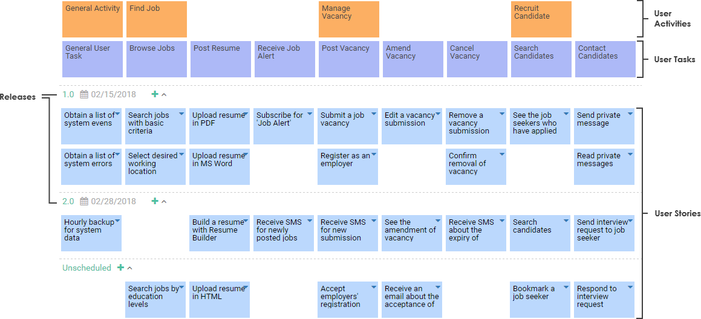

# User Story Mapping

Le _User Story Mapping_ est une **approche visuelle et pragmatique** pour **définir et prioriser** les besoins d'un produit.

Cette approche consiste à définir les [User Stories](../scrum/artefacts/user-story.md) en se **focalisant** sur les **principales interactions de l'utilisateur** avec le produit ainsi que son **parcours**.


Le _User Story Mapping_ doit se faire en présence de toutes les équipes impliquées dans la vie du produit _\(Achats, Marketing, Support, IT, Finance, Légal\)_.



La _User Story Map_ n'est jamais figée ou "finalisée". Elle est le produit d'un travail incrémental et itératif.


## Intérêts du User Story Mapping

**Focalisation sur la valeur** apportée au produit d'un point de vue **utilisateur**.

**Priorisation pragmatique** grâce à la vision d'ensemble.

**Définition plus claire des besoins** grâce au focus sur le parcours utilisateur.

**Réduction du Time to Market** et **livraison rapide et fréquente** de valeur.

**Mise en évidence des risques** et dépendances.

**Consensus** grâce à l'implication de tous et au travail d'équipe.

## Le User Story Mapping Etape par Etape

1. Recueillir les **besoins** _\(i.e. : use cases\)_.
2. Définir les scénarios et **étapes** de chaque besoin.
3. Définir les [User Stories](../scrum/artefacts/user-story.md) pour chacune des **étapes à planifier.**
4. Identifier les prérequis, difficultés et informations manquantes.
5. Prioriser les [User Stories](../scrum/artefacts/user-story.md).

