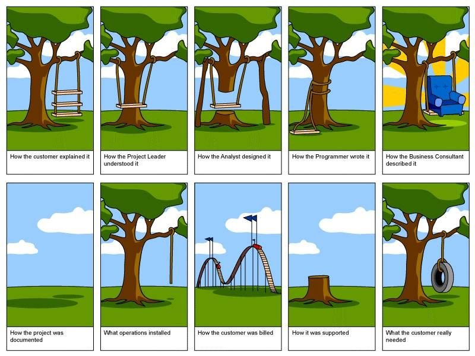

# Sans Agilité

## "Cycle" en racine carrée ou la caricature à éviter

### Le client exprime son besoin

avec une phrase...

> Je veux une application mobile pour un réseau social avec du rouge en couleur dominante.  
> Rendez-vous dans 6 mois.

... ou pire encore, avec un cahier des charges.

### 3 mois plus tard...

* Retards.
* Client déçu par la version beta.
* Trop tard pour tout remettre en question.
* Tensions avec le client et au sein de l'équipe.
* Le "lead developer" quitte l'entreprise.
* 3 nouveaux développeurs rejoignent l'équipe en renfort.
* Le renfort ralentit encore plus l'équipe.

  

## Coût du changement

Avec le cycle en V, le coût du changement augmente au fil du temps à travers le Software Development Life Cycle.

Il est donc plus difficile et plus cher de remédier à une erreur de conception à la livraison qu'au début des développements.

De même, sans méthode de développement, plus le développement avance, plus le code devient complexe et plus le changement est coûteux.

## Conséquences

### Conséquences générales

* _**Time to Market**_ **trop long**.
* **Manque de visibilité** sur l'avancement.
* **Pas de feedback** des clients et utilisateurs.
* **Vélocité** de l'équipe **en diminution** permanente à cause des imprévus.
* Absence de **Collective Ownership**.
* Décisions maladroites dans la panique et augmentation exponentielle du stress à l'approche des deadlines.

### Le paradoxe des spécifications

L'objectif principal de la rédaction de spécifications est de réduire les risque.

Paradoxalement, dans la plupart des cas, cela finit par **augmenter le risque et le coût au lieu de les réduire**.

#### Inconvénients de la rédaction de spécifications

* **Perte de temps** avant l'implémentation de la première fonctionnalité.
* **Incompréhensions** et conflit à la livraison / validation.
* **Déresponsabilisation** de l'équipe de développement car de nombreux choix sont figés par les spécifications.
* Le **rapport valeur vs. coût** de chaque fonctionnalité est rarement _\(ou difficilement\)_ pris en compte.
* Les besoins et contraintes ne sont probablement plus les mêmes entre le moment de la rédaction des spécifications et lors du développement de l'application.
* Problèmes de priorisation.
* **🤯** _**Over-thinking**_ **et** _**Analysis Paralysis**_.

### Conséquences techniques

* Peur du changement.
* Développement empirique.
* Complexité artificielle _\(i.e. : développement inutile ou inutilisable\)_.
* L'équipe est débordée par la correction de bugs.
  * La correction d'un bug en provoque un autre.
* Effet tunnel: Plusieurs fonctionnalités en cours de développement mais aucune de finalisée.
* 👹_Integration Hell_.

