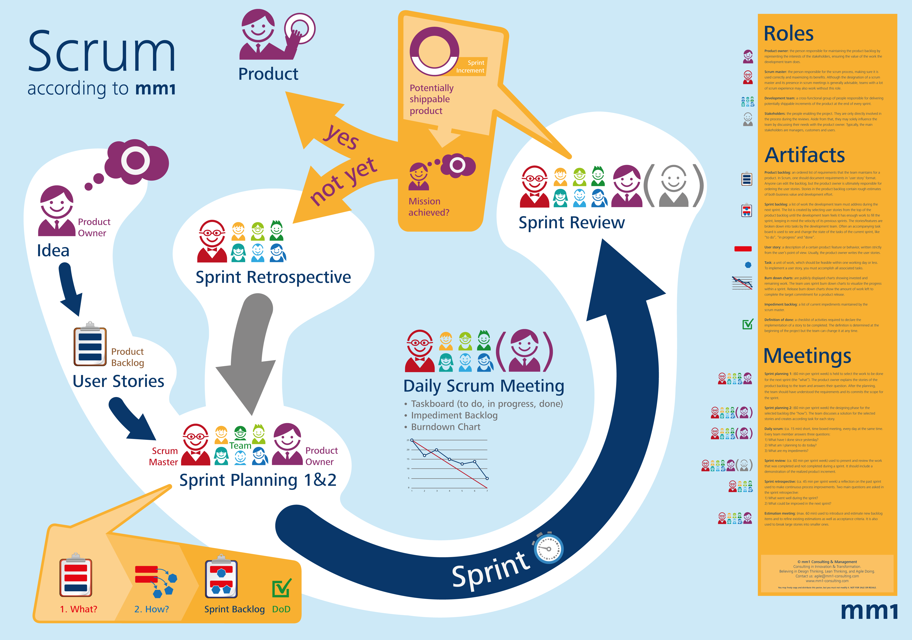

# Sprint

Le Software Development Life Cycle est divisé en **plusieurs itérations** _****_**\(ou sprints\)**.

Le **nombre** de sprints **à venir** est **indéfini**.

On arrête les **sprints** uniquement **quand on abandonne un produit**.

La **durée** d'un sprint **est fixée globablement** à une durée comprise entre 1 et 4 semaines.

La durée est généralement fixée à 2 semaines et **idéalement à 1 semaine**.


La durée ne varie pas d'un sprint à l'autre.



Dans le cas des équipes travaillant sur plusieurs projets, il est recommandé d'appliquer la même durée.


