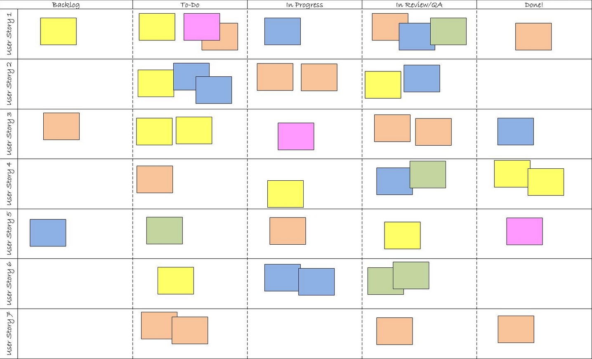

# Scrum Board

Le Scrum Board est un outil visuel permettant de visualiser l'avancement d'un Sprint.

Il doit être mis à jour par l'équipe en temps réel.

Le Scrum Board est intéressant et "ludique" mais il a de nombreuses limitations. Cf. [Outils](../../outils.md).

