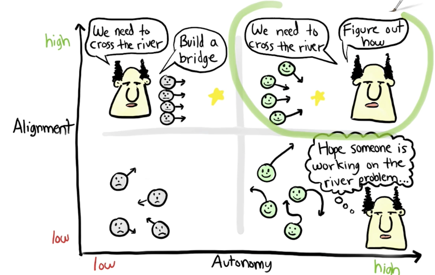
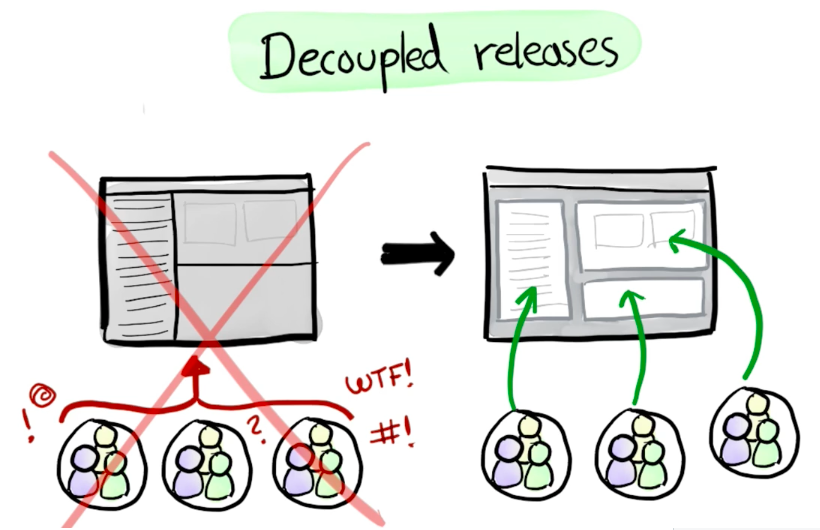

# Scrum Team

La Scrum Team est composée des rôles suivants :

## Development Team

**Qualités attendues :** autonome et communicante.

Elle est responsable de livrer des PSIs _\(Product Shippable Increment\)_.

C'est une équipe **autonome** et **autogérée** composée généralement de 3 à 9 personnes _\(développeurs / experts UX / graphic designer / expert sécurité etc...\)_.

Elle doit être protégée au maximum de toutes distractions externes _\(réunions superflues / interactions excessives avec le client ou d'autres équipes / téléphone / messagerie interne\)_.

## Product Owner

**Qualités attendues :** vision et disponibilité.

Il est le représentant du "client".

Il décrit et priorise les fonctionnalités à implémenter.

Il est responsable de garantir que l'équipe de développement produit bien de la valeur business.

Il n'intervient pas sur les décisions techniques.

## Scrum Master

**Qualités attendues :** capacité d'écoute et de pédagogie.

Il facilite les interactions entre le Product Owner et les développeurs.

Il débarrasse la Development Team de tous les obstacles qui peuvent l'empêcher d'atteindre ses objectifs.

Il permet à la Development Team de rester concentrée, motivée et créative.

Il conseille le Product Owner pour améliorer l'efficacité de la Development Team.

**Il ne gère pas la Development Team mais la "coach"** pour livrer des fonctionnalités de qualité.

Il promouvoit l'autogestion au sein de la Development Team.

Il aide le client à mieux comprendre les principes Scrum.


Les rôles "**Product Owner**" et "**Scrum Master**" **ne sont pas cumulables**.


